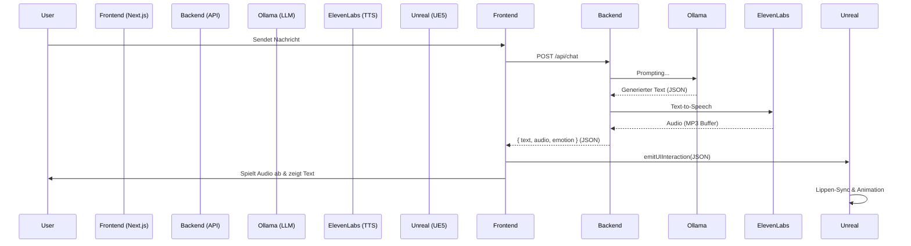

# Unreal Engine Integration Documentation

## 1. System Architektur

Das System koppelt einen Web-basierten Chatbot mit einem Unreal Engine MetaHuman für visuelle Darstellung.

**Komponenten:**
- **Frontend**: Next.js (React) + Pixel Streaming Player
- **AI Core**: Ollama (Llama 3.1) für Text-Generierung
- **Voice**: ElevenLabs TTS für Audio-Generierung
- **Visual**: Unreal Engine 5 (Pixel Streaming) für Rendering

## 2. Workflow (Data Flow)

Der Prozess ist **synchron**, um Lippen-Synchronität zu gewährleisten.



1.  User sendet Nachricht.
2.  Backend holt Text von Ollama.
3.  Backend schickt Text an ElevenLabs und erhält Audio zurück.
4.  Backend antwortet Frontend mit Text + Audio (Base64).
5.  Frontend sendet Audio und Steuerdaten an Unreal Engine.

## 3. API Spezifikation (Frontend -> Unreal)

Die Kommunikation erfolgt über **Pixel Streaming Data Channels** (`emitUIInteraction`).

**Payload (JSON):**

```json
{
  "type": "audio_response",
  "audio": "<Base64 Encoded Audio String>",
  "text": "Der gesprochene Text...",
  "emotion": "Happy" // oder "Sad", "Angry", "Neutral"
}
```

### Felder

| Feld | Typ | Beschreibung |
| :--- | :--- | :--- |
| `type` | `string` | Immer `"audio_response"`. Dient als Filter in UE Blueprints. |
| `audio` | `string` | Die Audio-Datei als Base64-String. Muss in UE decodiert werden. |
| `text` | `string` | Der Text, passend zum Audio (für Untertitel o.ä.). |
| `emotion` | `string` | Emotionstyp für MetaHuman Gesichtsausdrücke. |

## 4. Unreal Engine Implementierung

Um die Daten in Unreal Engine zu verarbeiten:

1.  **PixelStreamingInput Component**: Muss im Actor vorhanden sein.
2.  **Event**: `OnPixelStreamingInputEvent` abonnieren.
3.  **JSON Parsing**: Den Input-String parsen.
4.  **Base64 Decoding**: Den Inhalt von `audio` zu einem Byte-Array/SoundWave konvertieren.
5.  **Playback**: Audio abspielen (z.B. via RuntimeAudioImporter Plugin).
